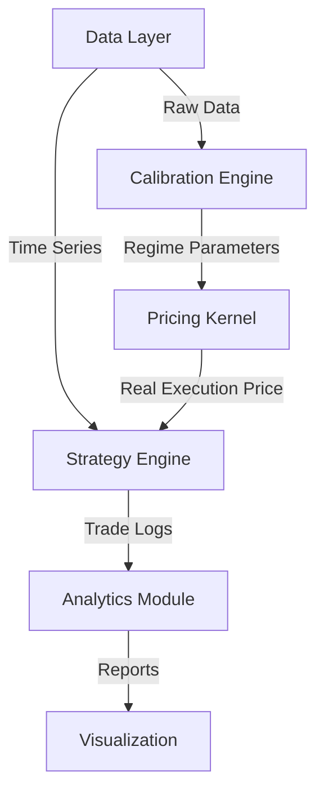

Here is a professional, comprehensive `README.md` for your project. You can copy this directly into your repository.

-----

# 🦎 Project Chameleon: Institutional Bitcoin Options Backtest Engine

**Bridging the gap between theoretical models and real-world institutional market structure.**

## 📖 Overview

Most crypto options backtests rely on "Paper World" assumptions: infinite liquidity, zero slippage, and textbook pricing models. They often show unrealistic profits for strategies like selling puts.

**Project Chameleon** changes this by injecting the **Microstructure of IBIT (BlackRock Bitcoin ETF)** into the backtest. By analyzing high-frequency tick data from Nasdaq, we calibrated how institutions actually price risk (Skew) and what they charge for liquidity (Spread) under different volatility regimes.

The result is a backtesting engine that simulates the **true cost of trading** Bitcoin options, distinguishing between "lucky" strategies and robust alpha.

-----

## 🏗 System Architecture

The project is designed as a modular, event-driven framework.



### 1\. Data Layer (`src/data_loader.py`)

We synthesize a master timeline using three key data sources:

  * **Deribit DVOL:** The "VIX of Bitcoin," used to define market regimes.
  * **BTC-USD Spot:** Daily OHLCV data from Yahoo Finance.
  * **Risk-Free Rates (IRX):** Dynamic treasury rates for accurate BSM pricing.
  * **IBIT Options Chain:** (Offline Analysis) Used to calibrate the pricing model.

### 2\. Microstructure Calibration (`dvol_regime_structure.py`)

We processed tick-level quote data from IBIT to map **DVOL levels** to **Market Structure**.
**Key Discovery:**

  * **The Skew Paradox:** Contrary to theory, high volatility in the current cycle does *not* always equal high Skew. Bull-run volatility often flattens the Skew.
  * **Liquidity Cost:** The "real" cost of protection (OTM Puts) involves a 5-6% bid-ask spread, which kills the performance of naive "Collar" strategies.

### 3\. Dynamic Pricing Kernel (`src/pricing.py` & `src/ibit_params.py`)

Instead of a standard Black-Scholes model, we use a **Regime-Switching Pricing Engine**:

  * **Input:** DVOL, Moneyness, Option Type.
  * **Logic:** Detects the regime (Low/Mid/High/Extreme) and applies the calibrated Skew and Spread.
  * **Output:** `Execution Price` (not Mid-Price). It simulates hitting the Bid (selling) or lifting the Ask (buying) with realistic slippage.

-----

## 🧬 Strategy Logic

We implement a suite of strategies to benchmark performance across different market cycles.

### 1\. The Chameleon (Flagship)

An adaptive strategy that toggles between "Yield" and "Defense" based on the Volatility Gap (Implied vs. Realized Vol).

  * **Condition A (Panic / Normal):** If Vol is expensive, sell **Cash-Secured Puts (CSP)** to harvest premium.
  * **Condition B (Cheap Vol):** If Vol is underpriced, switch to a **Collar** (Hold BTC + Buy Put + Sell Call) to lock in upside while protecting downside.

### 2\. The Wheel (Conservative)

  * **Phase 1:** Sell 15% OTM Puts to enter.
  * **Phase 2:** If assigned, hold BTC and sell 15% OTM Calls (Covered Call) to exit.
  * *Note:* Optimized with wider strikes to withstand Bitcoin's parabolic moves.

### 3\. Cash-Secured Put (CSP)

  * Pure income strategy. Sells 15% OTM Puts every 30 days.
  * Serves as a baseline for "Yield" performance.

### 4\. Wide Collar

  * The "Sleep Well" portfolio. Holds BTC, buys 15% OTM Puts, and finances them by selling 20% OTM Calls.
  * *Stress Test:* Used to verify if the cost of protection (Spread) outweighs the benefits.

-----

## 📂 Project Structure

```text
BTC_Options_Backtest/
├── data/                       # Raw CSVs (DVOL, Spot, IBIT data)
├── pic/                        # Generated charts (Equity curves, Drawdowns)
├── tbl/                        # Generated summary tables
├── src/
│   ├── __init__.py
│   ├── config.py               # Global settings (Capital, Paths)
│   ├── data_loader.py          # Data ingestion & cleaning
│   ├── ibit_params.py          # The "Brain": Calibrated Regime Parameters
│   ├── pricing.py              # BSM Engine with Skew/Spread injection
│   ├── strategy.py             # Event-driven strategy logic (Base + Derived classes)
│   └── analytics.py            # Performance metrics calculator
├── main.py                     # Entry point for Long-Term Simulation
├── rolling_analysis.py         # Entry point for Stability/Robustness Testing
├── dvol_regime_structure.py    # Standalone script for IBIT data calibration
└── requirements.txt            # Python dependencies
```

-----

## 🚀 How to Run

### 1\. Prerequisites

Ensure you have Python 3.8+ installed. Install dependencies:

```bash
pip install pandas numpy matplotlib seaborn yfinance scipy
```

### 2\. Long-Term Simulation (The "Durability Test")

Run the main backtest from 2020 to present. This generates equity curves and a performance summary table.

```bash
python main.py
```

  * **Output:** Checks `pic/` for Equity Curve and `tbl/` for the Performance Table.

### 3\. Rolling Window Analysis (The "Stability Test")

Run a robust stability check using a 1-Year Sliding Window (stepping forward 30 days at a time). This proves if the strategy works consistently or just got lucky in one bull run.

```bash
python rolling_analysis.py
```

  * **Output:** Generates a "Stability Report" table showing Win Rates, Min Sharpe Ratios, and Worst-Case Drawdowns.

-----

## 📊 Regimes & Parameters

Our engine uses the following calibrated parameters based on IBIT 2024 Tick Data:

| Regime | DVOL Range | Market State | Skew (90% Put) | OTM Spread | Logic |
| :--- | :--- | :--- | :--- | :--- | :--- |
| **LOW** | \< 50 | Calm / Range | **3.59%** | 4.55% | Protection is expensive (High Skew). |
| **MID** | 50 - 70 | Bull Trend | **1.01%** | 6.35% | Skew flattens; Liquidity cost rises. |
| **HIGH** | 70 - 90 | Fear (Est.) | **4.50%** | 10.0% | Extrapolated: Liquidity begins to dry up. |
| **EXTREME** | \> 90 | Crisis (Est.) | **8.00%** | 20.0% | Stress Test: Market breakdown. |

-----

## ⚠️ Disclaimer

  * **Educational Purpose:** This code is for research and educational purposes only.
  * **Extrapolation:** The High/Extreme regimes are extrapolated based on historical crypto crashes (3.12, FTX), as IBIT has not yet experienced a \>90 DVOL event.
  * **No Financial Advice:** Trading options involves significant risk.